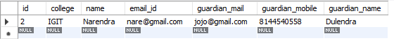

# SpringBootJpa
### Embedded 
- Embedded means if I have a **Student** and **Guardian** class and I don't want to keep fields of two classes in one class, so to separate the classes but have them embedded in Student only. The class is separated, not features. So, to achieve this, let's create Student and Guardian classes.

**Student**

```java
@Entity
@Data
@NoArgsConstructor
@AllArgsConstructor
@Builder
@Table(name="studentAlt",
            uniqueConstraints = @UniqueConstraint(name = "emailId_unique",columnNames = "emailId"))//here uniqueConstraints used for assigning a constraint to a pirticular Column
public class Student {

    @Id
    @SequenceGenerator(name = "student_seq",allocationSize = 1,sequenceName = "student_seq")
    @GeneratedValue(strategy = GenerationType.SEQUENCE,generator = "student_seq")
    private Integer id;
    private String name;
    
    @Column(name = "emailId",nullable = false)
    private String email;
    private String college;
    
    @Embedded //keyword used for to embedded guardian class and in mention class @Embeddable should present in class
    private Guardian guardian;
}
```
**Guardian**
```java
@Embeddable // here it specify that this class is a embeddable class
@Data
@AllArgsConstructor
@NoArgsConstructor
@AttributeOverrides({
        @AttributeOverride(name = "name", column = @Column(name = "guardian_name")), // here AttributeOverride work as to it'll replace the field name,email,mobile with guardian_name,guardianmail
        @AttributeOverride(name = "email",column = @Column(name = "guardian_mail")),
        @AttributeOverride(name = "mobile", column = @Column(name = "guardian_mobile"))
})
public class Guardian {
    private String name;
    private String email;
    private String mobile;
}
```
 <br>
it'll create this table in database
### ONE-TO-ONE
- one to one mapping is one **Course** has **Course Material**
- Main thing is in one to one it's most of time is bi-directional mapping,
- The difference between uni-directional and bi-directional is
- Consider the relationship between a Person and their Passport. Each person has exactly one passport, but a passport does not belong to multiple people. So, in this case, Person would have a reference to Passport, but Passport would not have a reference back to Person.
- Extending the previous example, let's make the relationship bi-directional. In addition to Person having a reference to Passport, Passport will also have a reference back to Person. This allows you to navigate from a Person to their Passport and from a Passport back to the corresponding Person.

**Course**
```java
@Entity
@Data
@AllArgsConstructor
@NoArgsConstructor
@Builder

public class Course {
    @Id
    @SequenceGenerator(allocationSize = 1,sequenceName = "course_seq",name = "course_seq")
    @GeneratedValue(strategy=GenerationType.SEQUENCE,generator = "course_seq")
    private Long id;
    private String title;
    private Integer credit;

    @OneToOne(mappedBy = "course")
    private CourseMaterial material;
}
```
- let's discuss some terms
@OneToOne(mappedBy = "course") : here mappedBy is used for the class where it's declared is already map by another class, and it'll not create any extra field in the table <br>
**Course Material**
```java
@Entity
@Data
@AllArgsConstructor
@NoArgsConstructor
@Builder
@ToString(exclude = "course")

public class CourseMaterial {

    @Id
    @SequenceGenerator(sequenceName = "course_material_Seq",name = "course_mat_seq",allocationSize = 100)
    @GeneratedValue(strategy = GenerationType.SEQUENCE,generator = "course_mat_seq")
    private Long id;
    private String url;

    @OneToOne(cascade = CascadeType.ALL,
            fetch = FetchType.LAZY,
            optional = false
    ) 
    @JoinColumn(name = "course_id",referencedColumnName = "id")
    private Course course;
}
```
- cascasde : this will update all the table which are declared or mapped in another class
- fetch : if the current entity class is  save than mentioned entity will fetch after saved, if it's EAGER than it'll fetch before saving the current entity
- In one-to-one @JoinColumn will create the extra foreign_key table in here own table , and we have to give the reference of mapping class reference 
### One-To-Many
- In one to many mapping The important thing is the extra field will crate at given specify table , not in own table like one-to-one
Let's take example and see how one-many works
**Course**
```java
@Entity
@Data
@AllArgsConstructor
@NoArgsConstructor
@Builder
public class Course {
    @Id
    @SequenceGenerator(allocationSize = 1,sequenceName = "course_seq",name = "course_seq")
    @GeneratedValue(strategy=GenerationType.SEQUENCE,generator = "course_seq")
    private Long id;
    private String title;
    private Integer credit;
}
```
**Teacher**
```java
@Entity
@Data
@AllArgsConstructor
@NoArgsConstructor
@Builder
public class Teacher {
    @Id
    @SequenceGenerator(initialValue = 1,allocationSize = 1,sequenceName = "teacher_seq",name = "teacher_seq")
    @GeneratedValue(strategy = GenerationType.SEQUENCE,generator = "teacher_seq")
    private Long tid;

    private String firstName;
    private String lastName;
    @OneToMany(cascade = CascadeType.ALL,fetch = FetchType.EAGER)
    @JoinColumn(name = "teacher_id",referencedColumnName = "tid")
    private List<Course> courses;
}
```
here **teacher_id** will create in Course table 
### Many-to-One
```java
@Entity
@Data
@AllArgsConstructor
@NoArgsConstructor
@Builder

public class Course {
    @Id
    @SequenceGenerator(allocationSize = 1,sequenceName = "course_seq",name = "course_seq")
    @GeneratedValue(strategy=GenerationType.SEQUENCE,generator = "course_seq")
    private Long id;
    private String title;
    private Integer credit;

    @ManyToOne(cascade = CascadeType.ALL)
    @JoinColumn(name = "teacher_id",
    referencedColumnName = "tid")
    private Teacher teacher;
}
```
Here teacher_id field will create in Course itself
